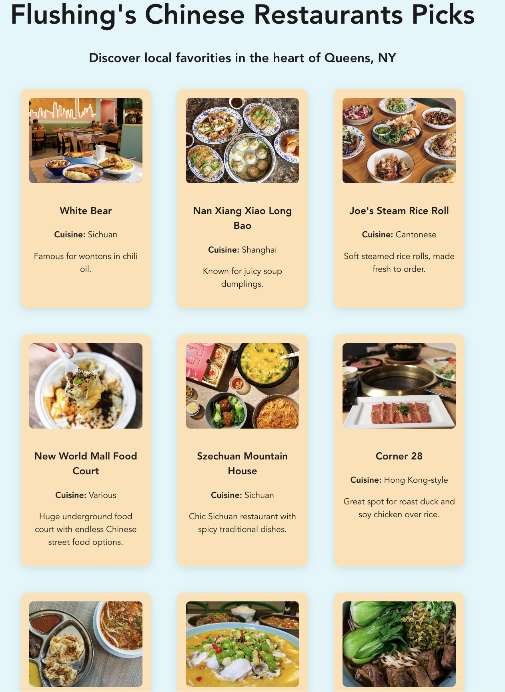

# Community Restaurants App

A simple, themed React web app showcasing local restaurants in a card-based layout.

---

## ✅ Required Features Checklist

- ✅ **Unique Theme:** The app is themed around **local restaurants** relevant to a specific community.
- ✅ **Header/Title:** A clear title is displayed at the top of the app.
- ✅ **10+ Unique Cards:** The app displays more than **10 unique restaurant cards**.
- ✅ **Responsive Layout:** Cards are shown in a **responsive grid format** that adjusts across screen sizes.
- ✅ **Card Information:** Each card contains:
  - Restaurant name
  - Image
  - Description

---

## 🖼 Screenshot & GIF

> Simple version of the app with all core features implemented:

